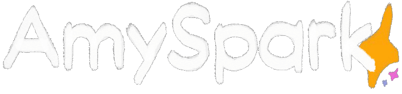

<a href = "https://AmySpark-ng.github.io">
	
	<!-- ^ Made by DevkyRD - https://twitter.com/fabiantol31 -->
</a>

## > About me ☂️
heyo! im Amy, using GitHub to share my projects with other people and because open source is very cool

Coding is painful, but very fun, so i'll be sticking around here ;)

## > Pinned repositories 🐙

— Some of my favorite repositories of mine:)

 

<!-- 

 -->

<!--  -->

- [Marktonator](https://markjam.repl.co/) - Coming soon

## > Stats 🖥️

	
— Github Stats:

	
	

##

— Im just a girl from the middle of nowhere
<!-- Girls and boys - underscores -->
